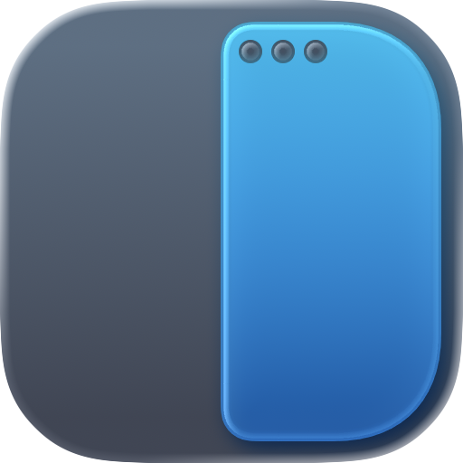
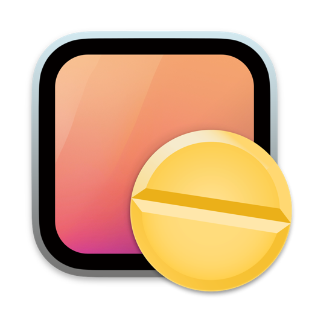
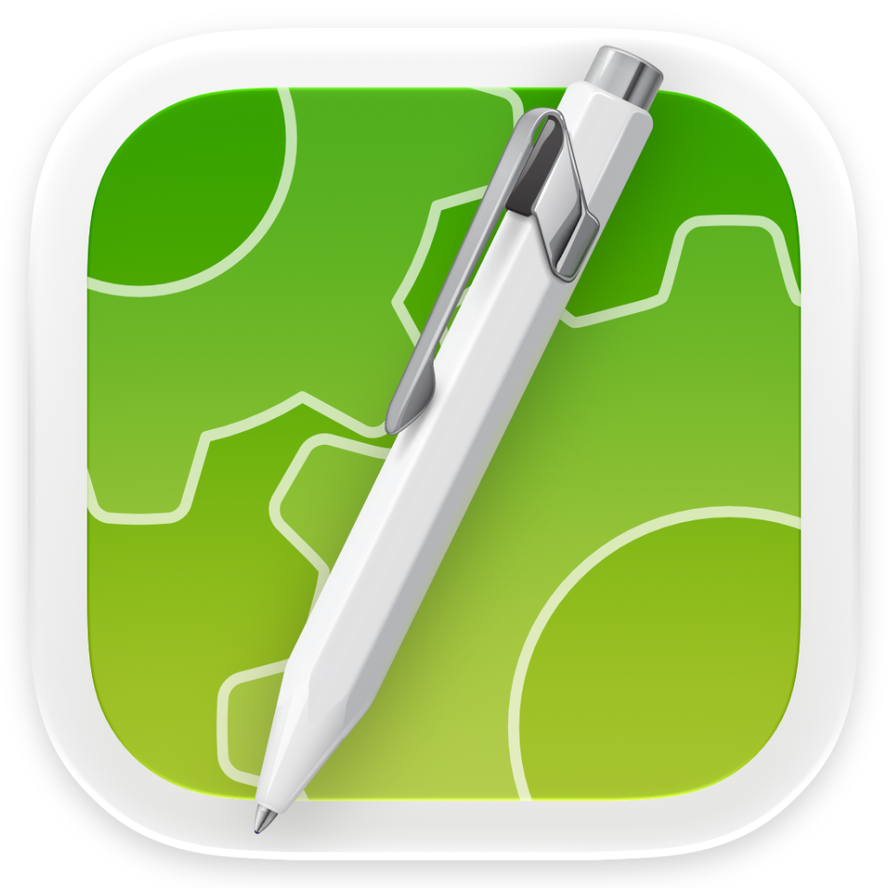
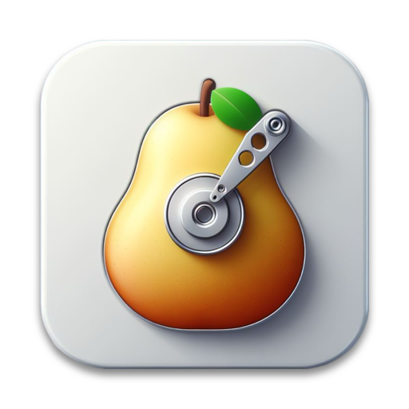
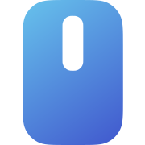
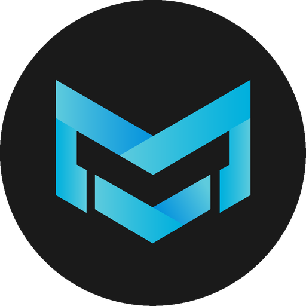
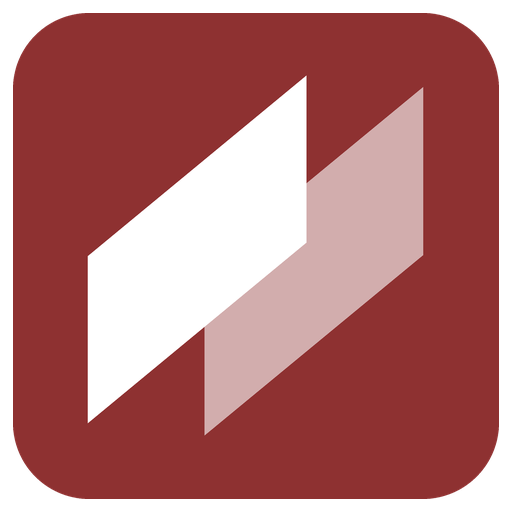

<div align="center">
  
  <h1>Appunto</h1>
  <p><strong>La tua prossima app per Mac e Android.</strong><br>
  Un catalogo personale di applicazioni utili, curate e piacevoli da usare, presentato come un piccolo desktop macOS dentro il browser.</p>
  <p>
    <a href="https://carellice.github.io/appunto/"></a>
  </p>
  <p>
    
    
    
    
  </p>
</div>

<p align="center">
  
  
  
  
  
  
  
  
  
  
</p>

## Cos’è

Appunto è una raccolta di app scelte personalmente da Flavio: piccoli strumenti che risolvono un problema preciso e lo fanno bene. Niente classifiche e niente pubblicità: ogni scheda spiega in poche righe cosa fa l’app, quando torna utile e dove scaricarla dal sito ufficiale.

Non serve installare nulla né registrarsi: si apre nel browser, da computer, tablet o telefono.

**👉 [carellice.github.io/appunto](https://carellice.github.io/appunto/)**

## Cosa trovi dentro

| Piattaforma | App | Categorie |
|---|---|---|
| **Mac** | 24 | Produttività, File e spazio, Scrittura e codice, Personalizzazione, Utility, Video e media |
| **Android** | 9 | Benessere, Video e media, Sport, Lettura, Giochi, Scrittura e codice, Utility |
| **iPhone e iPad** | In arrivo | — |

Qualche esempio: Rectangle per sistemare le finestre, Maccy per la cronologia degli appunti, Keka per comprimere i file, Pearcleaner per disinstallare le app senza lasciare residui, YTDLnis e Adobe Scan su Android.

## Come si usa

1. **Apri il sito** e attendi la breve schermata di avvio in stile Mac.
2. **Sfoglia la raccolta** scegliendo la piattaforma e la categoria dalla barra laterale, oppure cerca un’app per nome.
3. **Apri una scheda** per leggere cosa fa l’app, a cosa serve e raggiungere il sito ufficiale.

L’interfaccia si adatta al dispositivo:

- **Computer:** un desktop con finestra, Dock e menu, come su macOS. La finestra si può trascinare ed espandere.
- **Tablet:** lo stesso catalogo, con un layout pensato per lo schermo più ampio.
- **Telefono:** una Home a pagine orizzontali in stile iOS, con Dock e ricerca Spotlight. Le schede salgono dal basso a tutto schermo.

### Scorciatoie da tastiera

| Azione | Scorciatoia |
|---|---|
| Cerca un’app | <kbd>⌘</kbd> / <kbd>Ctrl</kbd> + <kbd>K</kbd> |
| Impostazioni | <kbd>⌘</kbd> / <kbd>Ctrl</kbd> + <kbd>,</kbd> |
| Espandi o ripristina la finestra | <kbd>⌘</kbd> / <kbd>Ctrl</kbd> + <kbd>↑</kbd> |

## Funzionalità

- **Schede dettagliate** con descrizione, utilità pratica e collegamento al sito ufficiale.
- **Ricerca Spotlight** per trovare subito un’app per nome.
- **Dock** con cinque app pescate a caso a ogni visita e pila delle categorie.
- **Sfondi casuali:** l’icona sul desktop cambia sfondo tra varianti scure e ad alto contrasto.
- **Impostazioni** per aspetto chiaro o scuro, animazioni, vista del catalogo e barra laterale.
- **Preferenze ricordate** nel browser, senza account.
- **Rispetto delle preferenze di sistema** per tema e riduzione del movimento.

## Avvio in locale

Serve [Node.js](https://nodejs.org/) 22.13 o superiore.

```bash
npm install
```

```bash
npm run dev
```

Vite stampa nel terminale l’indirizzo locale da aprire (di solito `http://localhost:5173`).

Per creare la build statica nella cartella `dist`:

```bash
npm run build
```

## Pubblicazione

Ogni push sul ramo `main` avvia il workflow [deploy-pages.yml](.github/workflows/deploy-pages.yml), che compila il progetto e lo pubblica su GitHub Pages. Il file `netlify.toml` permette in alternativa di pubblicarlo su Netlify.

## Struttura del progetto

```text
app/
├── apps.ts           # Catalogo e metadati delle applicazioni
├── page.tsx          # Desktop, Home del telefono e interazioni principali
├── system-panel.tsx  # Spotlight, impostazioni e pannelli di sistema
└── globals.css       # Stile, layout responsive e animazioni
src/
└── main.tsx          # Punto di ingresso React
public/
├── icons/            # Icone delle applicazioni
└── favicon.svg       # Logo di Appunto
```

## Aggiungere un’app

1. Aggiungi una voce in [app/apps.ts](app/apps.ts) con nome, `slug`, descrizione, categoria e sito ufficiale. Per un’app Android imposta `platform: 'Android'`.
2. Metti l’icona in `public/icons` chiamandola come lo `slug` (per esempio `rectangle.png`). Se il file ha un altro nome o formato, indicalo nel campo `icon`.

## Tecnologie

React 19, TypeScript, Vite, Tailwind CSS 4 e componenti Base UI / shadcn.

## Licenza e attribuzione

Il codice è distribuito con licenza [MIT](LICENSE).

Appunto è un progetto indipendente, non affiliato ad Apple né a Google. Le icone e i marchi delle applicazioni appartengono ai rispettivi sviluppatori e sono mostrati solo per identificarle.
